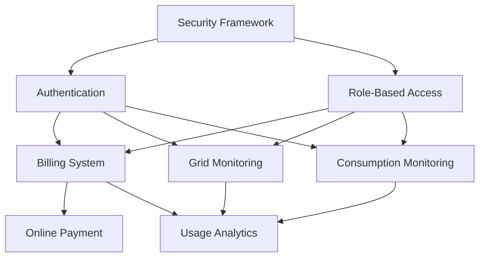

# Implementation Plan - Phase 3

## Implementation Sequence

### 1. Core Infrastructure (Sprint 1)
1. Security Framework
   - Role-based access control infrastructure
   - Authentication mechanism
   - Data encryption utilities
   - Audit logging framework

2. Common Components
   - Error handling
   - Validation framework
   - Event system
   - Logging infrastructure

### 2. Authentication & Security (Sprint 2)
1. User Authentication
   - Login/logout functionality
   - JWT token management
   - Session handling
   - Password management

2. Role-Based Access
   - Role management
   - Permission system
   - Access control implementation
   - Security filters

### 3. Monitoring Systems (Sprint 3)
1. Grid Monitoring
   - Real-time monitoring
   - Alert system
   - Status tracking
   - Performance metrics

2. Consumption Monitoring
   - Usage tracking
   - Data collection
   - Real-time updates
   - Historical data management

### 4. Billing & Payment (Sprint 4)
1. Billing System
   - Bill generation
   - Calculation engine
   - Invoice management
   - Payment tracking

2. Online Payment
   - Payment processing
   - Gateway integration
   - Transaction management
   - Receipt generation

### 5. Analytics & Reporting (Sprint 5)
1. Usage Analytics
   - Data analysis
   - Report generation
   - Trend analysis
   - Prediction models

2. Service Management
   - Request handling
   - Service tracking
   - Status updates
   - Notification system

## Component Dependencies

## Implementation Guidelines

### Testing Requirements
1. Unit Tests
   - Each component must have >80% coverage
   - All edge cases must be covered
   - Mock external dependencies

2. Integration Tests
   - Test component interactions
   - Verify system workflows
   - Test external integrations

3. BDD Tests
   - Cover all scenarios in feature files
   - Maintain step definitions
   - Regular test execution

### Quality Gates
1. Code Quality
   - SonarQube analysis
   - Code review approval
   - Documentation complete
   - Tests passing

2. Security
   - Security scan passed
   - Encryption verified
   - Access control tested
   - Audit logging confirmed

3. Performance
   - Load testing passed
   - Response times within SLA
   - Resource usage optimized
   - Scalability verified

## Risk Mitigation

### Technical Risks
1. Integration Complexity
   - Start with mock interfaces
   - Incremental integration
   - Regular integration testing

2. Performance Issues
   - Early performance testing
   - Monitoring setup
   - Optimization strategy
   - Scalability planning

3. Security Vulnerabilities
   - Regular security audits
   - Penetration testing
   - Code analysis
   - Security reviews

## Delivery Milestones

### Sprint 1 (Weeks 1-2)
- Core infrastructure setup
- Security framework implementation
- Common components development

### Sprint 2 (Weeks 3-4)
- Authentication system
- Role-based access control
- Security integration

### Sprint 3 (Weeks 5-6)
- Grid monitoring system
- Consumption tracking
- Alert system implementation

### Sprint 4 (Weeks 7-8)
- Billing system
- Payment processing
- Transaction management

### Sprint 5 (Weeks 9-10)
- Analytics implementation
- Service management
- System integration
- Performance optimization